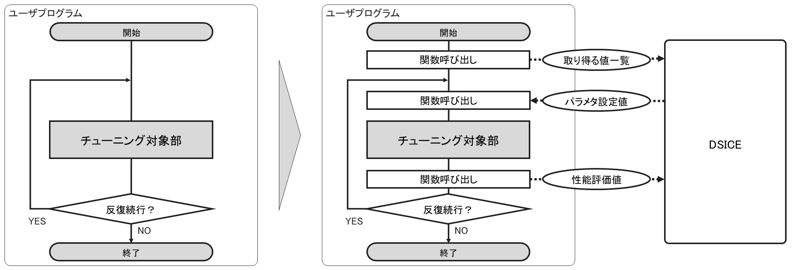
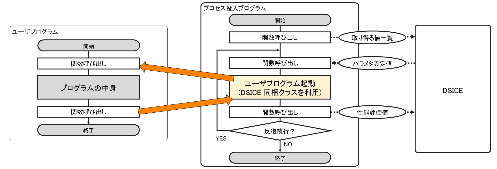

# DSICE の利用方式

DSICE には 2 種類の利用方式があります．

## 関数組み込み方式

関数組み込み方式は，ライブラリ関数をユーザプログラムから直接呼び出して利用する方式です．DSICE の基本となる利用方式となります．  
この方式ではユーザプログラムの実行中に，プログラムの挙動をリアルタイムに変化させます．

元々ユーザプログラム内のチューニング対象部が何度も繰り返し実行される構造になっていて，各ループごと，性能パラメタに異なる値を設定することが可能である場合に適しています．  
また，ソフトウェアに DSICE を完全に組み込む場合はこの方式を使用します．関数組み込み方式は余計な一時ファイルを生成せず，DSICE 特有の問題が発生しづらいのが利点です．

ただし，DSICE を利用するための設定等をユーザプログラム自体に記述しなければならない点には注意が必要です．ユーザプログラムにチューニングのためのコードが何行も記述されることで，コードの可読性が低下してしまう可能性があります．

## プロセス起動方式

プロセス起動方式は，ユーザプログラムの開始から終了までを 1 実行として，実行ごとに性能パラメタの設定値を指定する方式です．ユーザプログラムの起動操作が自動化されます．  
ユーザプログラム内で試行錯誤しながら動作する関数組み込み方式と異なり，プロセス起動方式はユーザプログラムの外側から試行錯誤を行います．

各実行前に性能パラメタ設定値を確定させるため，リアルタイムに性能変化するわけではありません．この方式はある性能パラメタに対する適切な値の**発見に**適しています．  
また，この方式では DSICE に関するコードの大半がユーザプログラムとは別で記述されます．ユーザプログラムで行うのは性能パラメタ設定値の受取と性能評価のみであり，コードの可読性を維持することができる利点もあります．特に，元々プログラムの最初に設定項目があるようなプログラムでは構造をそのまま利用できます．
