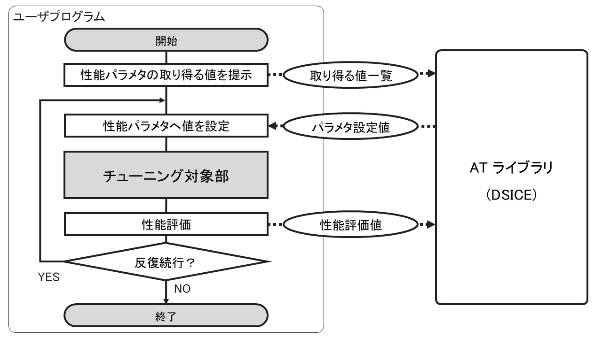

# ソフトウェア自動チューニングと DSICE

## ソフトウェア自動チューニング

ソフトウェア自動チューニング (AT : software automatic tuning) は，ソフトウェアの性能向上を自動化する技術，および研究分野です．  
ここで，「性能」には様々なものがあります．例として実行時間やメモリ使用量，正答率などがあげられます．

## DSICE による AT

AT のアプローチのひとつが，実際にプログラムを実行しながら行うチューニングです．

まず事前に，プログラム内で性能に影響を与える要因を抽出し，「性能パラメタ」としてパラメタ化します (ここの自動化も AT の研究対象ですが，DSICE の場合は人が行います)．この性能パラメタに適切な値を入れれば高い性能を引き出すことができますが，適切な値の選択には専門的な知識と多大な労力を要します．  
そこで，この「適切な値」の選択を AT で行います．いわば，人間が行う試行錯誤をツールが代行する形式です．

事前に AT ライブラリに対して，性能パラメタが取り得る値の一覧を渡します．ライブラリはこの一覧の中から適切な値を探すことになります．性能パラメタが複数ある場合は，それぞれの性能パラメタの取りうる値の組合せから適切な組合せを探します．  
その後，試行錯誤のためにループを開始します．ループの最初に，AT ライブラリはユーザプログラムに対して，性能パラメタに設定する値 (またはその組合せ) を指定します．ここで指定されるのは AT ライブラリが良さそうだと推定した暫定最良値，または推定のために試行すべきと判定した値です．ユーザプログラムはこの値を使ってチューニング対象部を実行します．最後に，ユーザプログラムはこのときの性能を評価し，ライブラリに渡します．  
1 ループ終わるごとに，性能パラメタの設定値とその場合の性能の組が得られます．AT ライブラリはこの情報を基に推定を行い，より良い性能パラメタ設定値を探していくことになります．
