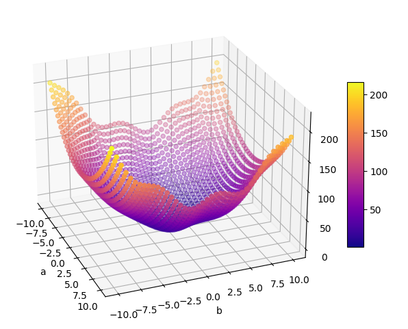

# チュートリアル 1 - 基本

簡単なプログラムで，最も基本となる使い方を学びます．

- [0. チューニング対象のプログラム](#0-チューニング対象のプログラム)
- [1. DSICE 使用の準備](#1-dsice-使用の準備)
- [2. インスタンスの作成](#2-インスタンスの作成)
- [3. 性能パラメタの設定](#3-性能パラメタの設定)
- [4. チューニング部分](#4-チューニング部分)
- [5. 動かしてみる](#5-動かしてみる)
- [6. ループごとのログを出力](#6-ループごとのログを出力)
- [7. チューニング結果を表示](#7-チューニング結果を表示)
- [最終的なコード](#最終的なコード)

## 0. チューニング対象のプログラム

チューニングの対象となるのは，性能パラメタと性能評価指標があるプログラムです．つまり前提として，ある変数にある値を代入すると，その値に従った性能でプログラムが動作する，という仕組みが必要となります．  
性能パラメタが存在するようなプログラムを実例として使うこともできますが (サンプルプログラムを参照してください)，そのようなプログラムはどうしてもコードが複雑になりがちで，チュートリアルには不向きです．

そこで，このチュートリアルでは次のように数式を利用し，疑似的に性能パラメタと性能評価指標があるプログラムを再現します．  
※ `cmath` のインクルードが必要です．

``` cpp
double func(double a, double b) {
    return a * a + (b - 1) * (b - 1) + a * sin(b) + b;
}
```

チュートリアルではこの関数の戻り値が**低いほど**良い性能であるとみなして，できるだけ小さな値が返ることを目指していきます．この関数は $a=0$, $b=\frac{1}{2}$ のときに最小値 $\frac{3}{4}$ を返します．  
なお，関数の形状は次の画像のようになっています．



これが繰り返し実行されます．ユーザプログラムは次のような構造です．

``` cpp
int main(void) {

    for (int i = 0; i < 100; i++) {
        double v = func(5, 5);
    }

    return 0;
}
```

## 1. DSICE 使用の準備

前提として，DSICE のインストール (環境変数設定含む) までは完了しているものとします．まだの場合は[導入](../../installation/installation_top.md)を参照してください．

DSICE を使うために，必要なヘッダファイルをインクルードします．  
ここではチューニングを行うために，基本となるチューニング機構を読み込みます．

``` cpp
#include <dsice_tuner.hpp>
```

DSICE のすべての要素は名前空間 `dsice` 内にあります．  
毎回 `dsice::` のように指定してもよいですが，チュートリアルでは簡単にするために省略可能な状態としておきます．

``` cpp
using namespace dsice;
```

## 2. インスタンスの作成

チューニング機構のインスタンスを作成します．チューニングを行うループよりも前の位置であればどこでも構いません (今回は1箇所しかありませんが)．  
性能パラメタの値型をここで指定します．指定可能な型は `int`，`long long`，`std::size_t`，`float`，`double` です．

``` cpp
Tuner<double> tuner;
```

なお，デフォルト型として `double` が指定されています．  
C++17 以上ではテンプレート引数推論により，`double` を使用する場合は次のような省略形の指定も可能です．

``` cpp
Tuner tuner;
```

## 3. 性能パラメタの設定

性能パラメタを指定します．

今回の対象には性能パラメタが 2 つあるので，まずそれぞれの取りうる値を列挙します．  
「取り得る」と言っていますが，今回の対象のようにどんな値でも代入可能な場合があります．このような場合はおおむね決め打ちで列挙する値を決めます．  
ここでは `func()` の第一引数 `a` の候補を `param1`，第二引数 `b` の候補を `param2` として列挙します．

``` cpp
std::vector<double> param1 = {-5.0, -4.5, -4.0, -3.5, -3.0, -2.5, -2.0, -1.5, -1.0, -0.5, 0.0, 0.5, 1.0, 1.5, 2.0, 2.5, 3.0, 3.5, 4.0, 4.5, 5.0};
std::vector<double> param2 = {-3.0, -2.5, -2.0, -1.5, -1.0, -0.5, 0.0, 0.5, 1.0, 1.5, 2.0, 2.5, 3.0, 3.5, 4.0, 4.5, 5.0, 5.5, 6.0, 6.5, 7.0};
```

その後，この一覧をチューニング機構に登録します．  
登録には [`appendParameter()`](../../dsice_api/for_cpp/cpp_tuner.md#appendparameter) を使用します．

``` cpp
tuner.appendParameter(param1);
tuner.appendParameter(param2);
```

## 4. チューニング部分

ループ内にチューニング用コードを書き込みます．

チューニングのループでは，次の流れがセットになっています．

1. DSICE から性能パラメタへの設定値を受け取る
2. ユーザプログラム内で値を設定，使用する
3. 性能評価を行い，性能評価値を DSICE に教える

性能パラメタへの設定値を 1 組受け取るには，[`getSuggestedNext()`](../../dsice_api/for_cpp/cpp_tuner.md#getsuggestednext) を使用します．

``` cpp
std::vector<double> suggested = tuner.getSuggestedNext();
```

受け取った値を使い，対象プログラムを動かします．  
受け取った `vector` 内の要素順序は，性能パラメタを登録した順番です．例えば今回の場合，`param1` の中から `suggetsed[0]` が，`param2` の中から `suggested[1]` が選択されます．

``` cpp
double v = func(suggested[0], suggested[1]);
```

最後に，性能評価値を DSICE に渡します．渡すためには [`setMetricValue()`](../../dsice_api/for_cpp/cpp_tuner.md#setmetricvalue) を使用します．

``` cpp
tuner.setMetricValue(v);
```

以上で，チューニング部分の基本的な記述は終わりです．

## 5. 動かしてみる

ここで，いったん動かしてみましょう．

DSICE は正常にインストールされているものとします．  
まだの場合は，[導入](../../installation/installation_top.md) を参考にインストールを行ってください．

環境により動かし方も様々ですが，ここでは例として，Linux の `g++` を使った例を示します．`-lDSICE` オプションを忘れないようにしてください．  
※ ここでは今回のプログラムを `user.cpp` とします．

``` bash
g++ user.cpp -lDSICE
```

``` cpp
./a.out
```

エラーなく，何も表示されなければ成功です．

## 6. ループごとのログを出力

ここまででチューニングはできますが，チューニングの様子は不明です．  
以下の [`printSimpleLoopLog()`](../../dsice_api/for_cpp/cpp_tuner.md#printsimplelooplog) を [`setMetricValue()`](../../dsice_api/for_cpp/cpp_tuner.md#setmetricvalue) の直後に追加することで，そのループの情報を表示できます．

```cpp
tuner.setMetricValue(v);
tuner.printSimpleLoopLog(); // 追加
```

これにより，次のように「何ループ目か」「裏で動作中のアルゴリズム」「基準**座標**」「今回のループで性能パラメタに設定された値の**座標**」「今回のループの性能評価値」が表示されます．  
実際に性能パラメタに設定された値ではなく，その座標インデックスである点に注意してください．例えば次の表示は `param1[10]` と `param2[10]` の組，つまり `{0.0, 2.0}` が指定されたことを表しています．

``` bash
Loop = 1
    Searching Mode : Initial Search
    Base Point : 10 10
    Measured Point : 10 10
    Performance : 3
```

## 7. チューニング結果を表示

ループの終了後，結果を表示しましょう．  
[`printTuningResult()`](../../dsice_api/for_cpp/cpp_tuner.md#printtuningresult) により，最終結果を表示することができます．チューニングループの終了後に呼び出してください．

``` cpp
tuner.printTuningResult();
```

次のように結果が表示されるはずです．

``` bash
[Tuning Result]
    Searching Status : Finish
    Measured Points : 28 / 441 (6%)
    Parameter : 0 0.5 (Coordinate : 10 7)
    Performance Value : 0.75
```

1 行目の「Searching Status」は，チューニングが最後まで完了したかどうかを表しています．今回の例では `for` 文によって 100 ループだけ実行していますが，この 100 ループで完了したとは限りません (全体で $21\times 21=441$ 候補あるので，全候補 1 回ずつ試すとすると 441 ループ必要です)．しかし，この例では推定などにより，100 ループ以内にチューニングを完了させることができたようです．  
2 行目には，候補中の何点をチューニングのために実測したかが表示されています．今回は全体の 6% のみでチューニングを完了したようです．  
3 行目は，DSICE が最終的に良いと判定した性能パラメタ設定値が表示されています．また，4 行目にはそのときの性能評価値が表示されています．最初に説明したように，関数 `func()` は $a=0$, $b=\frac{1}{2}$ のときに最小値 $\frac{3}{4}$ をとります．無事，DSICE は最良値を発見し，チューニングを行うことができたということですね．

## 最終的なコード

ユーザプログラムは元々，次のようなコードでした．

``` cpp
#include <vector>
#include <cmath>

double func(double a, double b) {
    return a * a + (b - 1) * (b - 1) + a * sin(b) + b;
}

int main(void) {

    for (int i = 0; i < 100; i++) {
        double v = func(5, 5);
    }

    return 0;
}
```

これが，これまでの手順によって次のように変化しました．

``` cpp
#include <vector>
#include <cmath>
#include <dsice_tuner.hpp>

using namespace dsice;

double func(double a, double b) {
    return a * a + (b - 1) * (b - 1) + a * sin(b) + b;
}

int main(void) {

    Tuner<double> tuner;

    std::vector<double> param1 = {-5.0, -4.5, -4.0, -3.5, -3.0, -2.5, -2.0, -1.5, -1.0, -0.5, 0.0, 0.5, 1.0, 1.5, 2.0, 2.5, 3.0, 3.5, 4.0, 4.5, 5.0};
    std::vector<double> param2 = {-3.0, -2.5, -2.0, -1.5, -1.0, -0.5, 0.0, 0.5, 1.0, 1.5, 2.0, 2.5, 3.0, 3.5, 4.0, 4.5, 5.0, 5.5, 6.0, 6.5, 7.0};

    tuner.appendParameter(param1);
    tuner.appendParameter(param2);

    for (int i = 0; i < 100; i++) {

        std::vector<double> suggested = tuner.getSuggestedNext();

        double v = func(suggested[0], suggested[1]);

        tuner.setMetricValue(v);
        tuner.printSimpleLoopLog();
    }

    tuner.printTuningResult();

    return 0;
}
```

2 つのコードを，改めて見比べてみてください．チューニング自体は複雑なことを行っていますが，ユーザプログラムの構造は大きく変化していません．`func()` の呼び出し時に指定する引数が変化している程度です．

以上でチュートリアル 1 は終了です．
