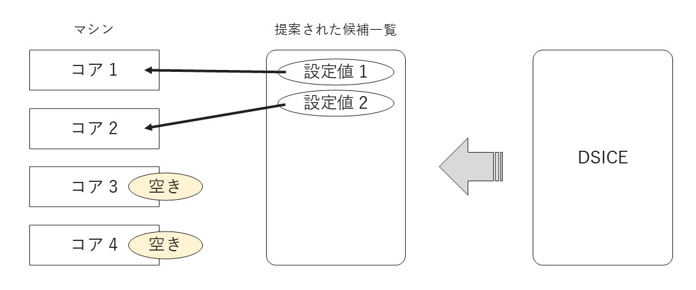
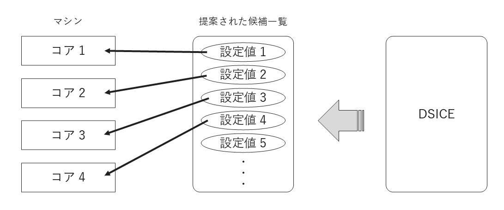

# チュートリアル 3 - 並列探索

並列試行によるチューニングを学びます．

## 0. はじめに

[チュートリアル 1](../tutorial1/tutorial1_cpp.md) と [チュートリアル 2](../tutorial1/tutorial2_cpp.md) では 1 ループにつき 1 回の試行，性能評価を行っていました．  
チュートリアル 3 では，試行を 1 ループに複数，並列に行う方法を学びます．並列探索を行うことで，特に計算資源が豊富な高性能マシンにおいて，チューニング完了までの時間が大幅に短縮される可能性があります．

なお，このチュートリアルは[チュートリアル 1](../tutorial1/tutorial1_cpp.md) の続きから始まります．  
以下に[チュートリアル 1](../tutorial1/tutorial1_cpp.md) の最終的なコードを再掲します．

``` cpp
#include <vector>
#include <cmath>
#include <dsice_tuner.hpp>

using namespace dsice;

double func(double a, double b) {
    return a * a + (b - 1) * (b - 1) + a * sin(b) + b;
}

int main(void) {

    Tuner<double> tuner;

    std::vector<double> param1 = {-5.0, -4.5, -4.0, -3.5, -3.0, -2.5, -2.0, -1.5, -1.0, -0.5, 0.0, 0.5, 1.0, 1.5, 2.0, 2.5, 3.0, 3.5, 4.0, 4.5, 5.0};
    std::vector<double> param2 = {-3.0, -2.5, -2.0, -1.5, -1.0, -0.5, 0.0, 0.5, 1.0, 1.5, 2.0, 2.5, 3.0, 3.5, 4.0, 4.5, 5.0, 5.5, 6.0, 6.5, 7.0};

    tuner.appendParameter(param1);
    tuner.appendParameter(param2);

    for (int i = 0; i < 100; i++) {

        std::vector<double> suggested = tuner.getSuggestedNext();

        double v = func(suggested[0], suggested[1]);

        tuner.setMetricValue(v);
        tuner.printSimpleLoopLog();
    }

    tuner.printTuningResult();

    return 0;
}
```

## 1. 内部アルゴリズムを並列探索アルゴリズムに変える

DSICE には，並列探索用のアルゴリズムが存在します．  
デフォルトの (並列探索用ではない) アルゴリズムとの大きな違いは，DSICE によって提案される性能パラメタ設定値の数です．デフォルトのアルゴリズムを単に並列探索で使用しても，各ループで提案される数が少ないために十分な並列度が確保できない可能性が高くなります．



これに対し，並列探索用のアルゴリズムは毎ループ，できるだけ多くの設定値候補を提案することを目指して作られています．候補が十分に存在することで，存在する計算資源を活用しやすくなります．



では並列探索用のアルゴリズムを常に使えば良いかというと，そうとも限りません．  
逐次探索用アルゴリズムはできるだけ少ない試行結果 (標本データと言います) から，素早く推定結果を導くように設計されています．それに比べると並列探索用アルゴリズムは推定結果を得るまでに少し多めに標本データを用意する必要があり，逐次探索で並列探索用アルゴリズムを使ってしまうと逆にチューニングに要する時間が増大してしまう可能性があるので注意が必要です．  
逐次探索を行うか並列探索を行うかに応じて，適切なアルゴリズムを選択することが大切です．

DSICE では，逐次用と並列用のアルゴリズムを 1 つの関数呼び出しで切り替えられるようになっています．  
並列探索用アルゴリズムを使用する場合はチューニング機構の生成後，チューニングを開始するまでの間に [`config_setParallelMode()`](../../dsice_api/for_cpp/cpp_tuner.md#config_setparallelmode) を呼び出してください．

``` cpp
Tuner<double> tuner;
tuner.config_setParallelMode(); // 追加
```

## 2. 性能パラメタ設定値の候補一覧を取得する

[チュートリアル 1](../tutorial1/tutorial1_cpp.md) では，性能パラメタに設定する値を 1 組だけ受け取りました．  
[`getSuggestedNext()`](../../dsice_api/for_cpp/cpp_tuner.md#getsuggestednext) は最優先で実測すべきと判断されている性能パラメタ設定値を取得できますが，値は 1 組しか受け取ることができません．並列試行のためには，何らかの方法で複数の値を受け取らなければならないわけです．

そこで，この部分を [`getSuggestedList()`](../../dsice_api/for_cpp/cpp_tuner.md#getsuggestedlist) に変更します．この関数は試行する際の候補を一覧にして返すので，この一覧から必要なだけ設定し，実行すれば良いです．  
なお，この一覧の要素は試行優先度の高い順に並んでいます．例えば最初の要素 (この例における `suggested_list[0]`) は，[`getSuggestedNext()`](../../dsice_api/for_cpp/cpp_tuner.md#getsuggestednext) で取得する，最優先で実測すべき値そのものです．

``` cpp
// std::vector<double> suggested = tuner.getSuggestedNext();
std::vector<std::vector<double>> suggested_list = tuner.getSuggestedList();
```

## 3. 並列に試行する

候補一覧を受け取ったら，並列に試行させます．

ここで，**試行するのは一覧の候補すべてである必要はありません**．  
DSICE は性能評価値を受け取るごとに推定状況を更新し，より良い可能性が高い設定値にあたりをつけます．候補一覧が試行優先度の高い順になっていることもあり，効率的なチューニングのためには，できるだけ頻繁な推定状況更新を行いつつ，優先度の高い候補に絞って試行を行うことが大切です．  
可能であれば，マシンの最大並列実行数に合わせて試行することが望ましいです．例えばマシンの CPU コア数が 4 であれば，候補一覧の上位 4 つを試行する，といった具合です．

並列試行の方法は様々ですが，DSICE の説明から離れてしまうため省略します．各マシン，プログラムなどに合った方法を使用してください．  
なお，DSICE のプロセス起動機能を利用することでも並列試行が可能です．

ここでは [OpenMP](https://www.openmp.org/) を利用した簡単なスレッド並列を例で示します．  
`parallel for` 節で `func` を並列に呼び出します．このとき，性能評価値は候補一覧の順序と一致するように格納しておいてください．

``` cpp
// 性能評価値を一時的に格納
std::vector<double> metrics(4);

// CPU コアが 4 の場合に，4 スレッドで並列試行する例
#pragma omp parallel for num_threads(4)
for (int j = 0; j < 4; j++) {

    double v = func(suggested_list[j][0], suggested_list[j][1]);

    // 候補一覧の順序と一致するように格納
    metrics[j] = v;
}
```

なお探索終盤になると，`getSuggestedList()` で取得するリストの要素数が少なくなります．  
要素数が 4 に満たず，例えば `j == 3` のとき `suggested_list[3]` に対して Segmentation Fault (メモリアクセス違反) となる可能性があるため，実際には次のように工夫してあげる必要があります．

``` cpp
// 4 か要素数のどちらか小さい値を使う
int searching_threads_num = ((suggested_list.size() < 4) ? suggested_list.size() : 4);

// 性能評価値を一時的に格納
std::vector<double> metrics(searching_threads_num);

// CPU コアが 4 の場合に，4 スレッドで並列試行する例
#pragma omp parallel for num_threads(searching_threads_num)
for (int j = 0; j < searching_threads_num; j++) {

    double v = func(suggested_list[j][0], suggested_list[j][1]);

    // 候補一覧の順序と一致するように格納
    metrics[j] = v;
}
```

## 4. 性能評価値を DSICE に渡す

最後に，性能評価値の一覧を DSICE に渡します．

`setMetricValue()` の代わりに `setMetricValuesList()` を呼び出し，一覧を渡してください．

``` cpp
// tuner.setMetricValue(v);
tuner.setMetricValuesList(metrics);
```

## 5. ログなど

ログなどについては逐次の場合と変わりません．

## 最終的なコード

最終的に，次のようなコードになりました．

``` cpp
#include <vector>
#include <cmath>
#include <dsice_tuner.hpp>

using namespace dsice;

double func(double a, double b) {
    return a * a + (b - 1) * (b - 1) + a * sin(b) + b;
}

int main(void) {

    Tuner<double> tuner;
    tuner.config_setParallelMode();

    std::vector<double> param1 = {-5.0, -4.5, -4.0, -3.5, -3.0, -2.5, -2.0, -1.5, -1.0, -0.5, 0.0, 0.5, 1.0, 1.5, 2.0, 2.5, 3.0, 3.5, 4.0, 4.5, 5.0};
    std::vector<double> param2 = {-3.0, -2.5, -2.0, -1.5, -1.0, -0.5, 0.0, 0.5, 1.0, 1.5, 2.0, 2.5, 3.0, 3.5, 4.0, 4.5, 5.0, 5.5, 6.0, 6.5, 7.0};

    tuner.appendParameter(param1);
    tuner.appendParameter(param2);

    for (int i = 0; i < 100; i++) {

        std::vector<std::vector<double>> suggested_list = tuner.getSuggestedList();

        std::size_t searching_threads_num = ((suggested_list.size() < 4) ? suggested_list.size() : 4);

        std::vector<double> metrics(searching_threads_num);

        #pragma omp parallel for num_threads(searching_threads_num)
        for (int j = 0; j < searching_threads_num; j++) {

            double v = func(suggested_list[j][0], suggested_list[j][1]);

            metrics[j] = v;
        }

        tuner.setMetricValuesList(metrics);
        tuner.printSimpleLoopLog();
    }

    tuner.printTuningResult();

    return 0;
}
```
